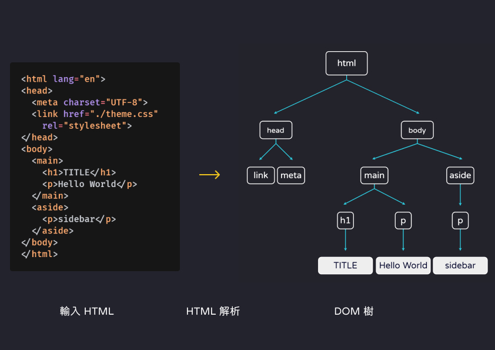
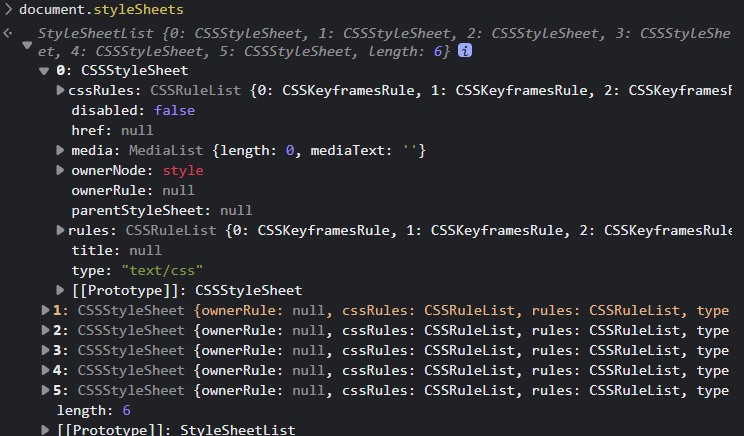
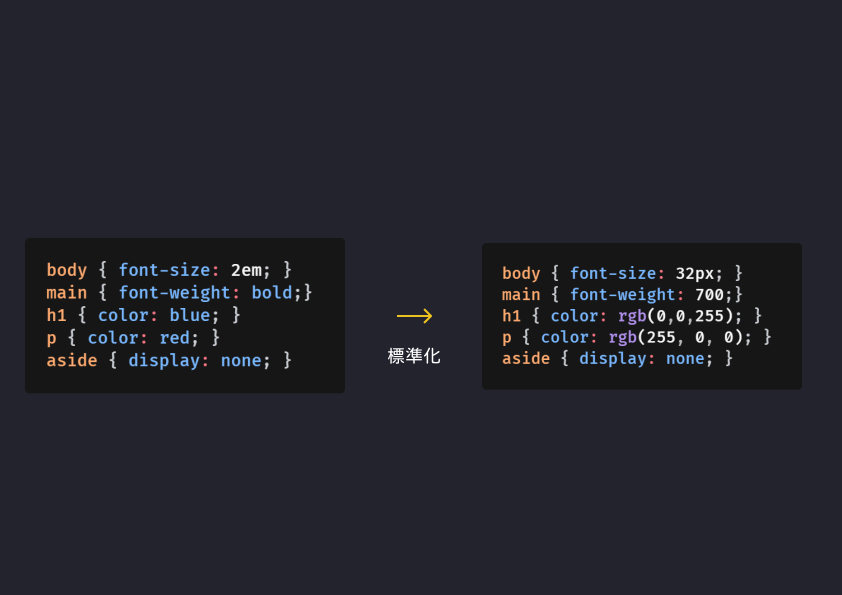
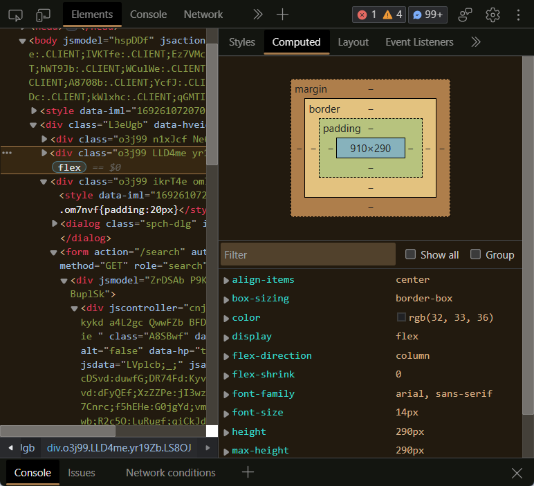
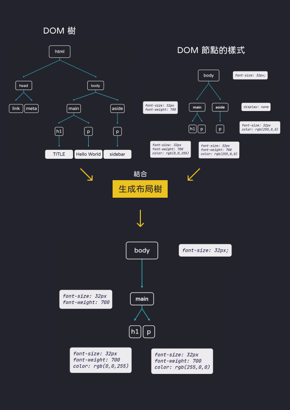
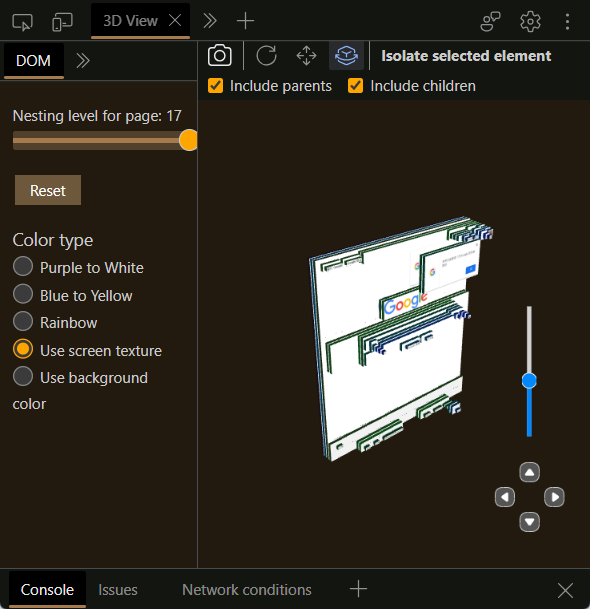

# 瀏覽器是如何把 HTML 轉成頁面？ - 面試愛考的瀏覽器渲染流程

瀏覽器渲染流程是面試常問的題目，理解之後對於優化網站速度也有幫助，
而過程可以簡單分為幾個步驟

1. 建構 DOM 樹
2. 樣式計算
3. 布局階段

在樣式計算和布局階段這塊又可以再細分出一些流程，就讓我們看看瀏覽器到底是怎麼渲染出一個頁面的吧！

## 建構 DOM 樹

因為瀏覽器是無法直接看懂我們寫的 HTML 檔案的，所以它會先將整個 HTML 轉換成 DOM 樹，列出每個 DOM 節點之間的關係，如圖

（樹是一種資料結構，就像 JS 裡的陣列、map、set 一樣，只是在瀏覽器中更常使用樹）

瀏覽器建構完 DOM 樹後，就會進到下個階段，計算每一個 DOM 節點的樣式。

## 樣式計算

樣式計算可以分成幾個步驟

1. 把 CSS 轉成瀏覽器能夠理解 stylesheet
2. 標準化樣式表中的屬性
3. 計算 DOM 節點的具體樣式

### 把 CSS 轉成瀏覽器能夠理解 stylesheet

和 HTML 一樣，瀏覽器也看不懂我們寫的 css ，所以他會將 css 轉換成 stylesheet，你可以打開控制台輸入 `document.stylesheet`，就可以看到瀏覽器轉換的結果

裡面的結構比較複雜，主要也是給瀏覽器看的，這裡就不探討太多，當個小知識就好。

### 標準化樣式表中的屬性

接著瀏覽器會標準化 CSS 中的屬性，簡單來說就是把 2em、4rem 等單位轉換成 px，而 light、bold 轉換成數字等等

(這裡圖要自己做)

### 計算 DOM 樹中每個節點的具體樣式

標準化完，瀏覽器就會計算每個節點中的具體樣式了，計算的過程又會遵循兩種規則

1. **層級規則**
    
    CSS 的來源可以大致分為三種
    
    1. 瀏覽器預設
    2. 用戶自訂義的 CSS
    3. 開發者寫的 CSS，而開發者寫的 CSS 又會遵循 CSS 的權重優先序，因為篇幅就不提太多
    
    層級規則就是會去算出這幾種的優先順序
    
2. **繼承規則**
    
    這個規則很簡單，就是子元素會去繼承父元素的屬性
    
    比如父元素設定 `color: white`，子元素在預設的情況下就會去繼承父元素的白色文字
    

可以在開發工具裡的 Elements → Computed 看計算完的結果

## 布局階段

現在瀏覽器有了 DOM 樹和每個節點的樣式了，接下來就會進入正式布局的環節，這裡可以分為兩個階段

1. 創建布局樹
2. 計算布局

### 創建布局樹

一開始瀏覽器會將 DOM 樹和 stylesheet 結合，在這裡會把不可見的節點忽略掉，例如 html、head 或是有 display: none 的元素

可以看到不可見的元素都不會再布局樹裡面

### 布局計算

接下來瀏覽器會開始計算布局，這個階段比較複雜，可以分細分成

1. 分層 Layer
    
    CSS 有很多複雜的效果，例如 3D 的 translateZ、rotate，或是 z-index、opacity 等等都要計算元素的前後關係，所以瀏覽器會先將某些元素分層。
    
    基本上有設定 position、z-index、filter … 等元素都會被分成單獨一層，一樣可以打開開發工具的 3D View 來觀看每層的關係
    
    
    
2. 製作繪製列表 paint
    
    分完層後，瀏覽器會根據每個元素去製作繪製列表指令，並提交給合成線程進行最後的繪製，也就是下一步的 raster。
    
3. 柵格化 raster
    
    在渲染前，瀏覽器會先將整個頁面切成好幾塊 **(tiles)** ，這是因為我們不會一次看到整個網站，而是慢慢往下滾，所以瀏覽器會根據視窗大小來切塊，優化速度。
    
    切塊完後就會進行計算，算出每個地方要填充多少像素顏色等，這個過程叫做**柵格化 raster，因為有大量運算所以會交給 GPU 執行。**
    
4. 合成 & 顯示 Draw & display
    
    當 GPU raster 結束後，就會執行 draw 填充顏色
    
    填充完，就會告訴瀏覽器說，我搞定了，你可以來將會畫完的內容顯示在瀏覽器上了，也就是 display
    

## 小結

到這裡，瀏覽器才終於把網站渲染出來，可真是經歷千辛萬苦，下面我又最後一張圖來總結全部個過程。

知道這些過程，對於優化網站速度是有幫助的，下一篇就來看看如何在這些過程中優化網站的速度吧！