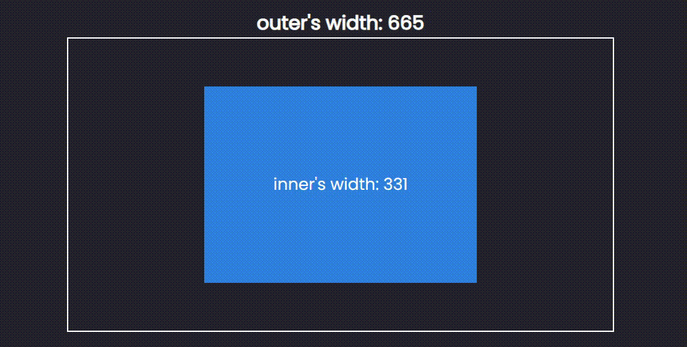
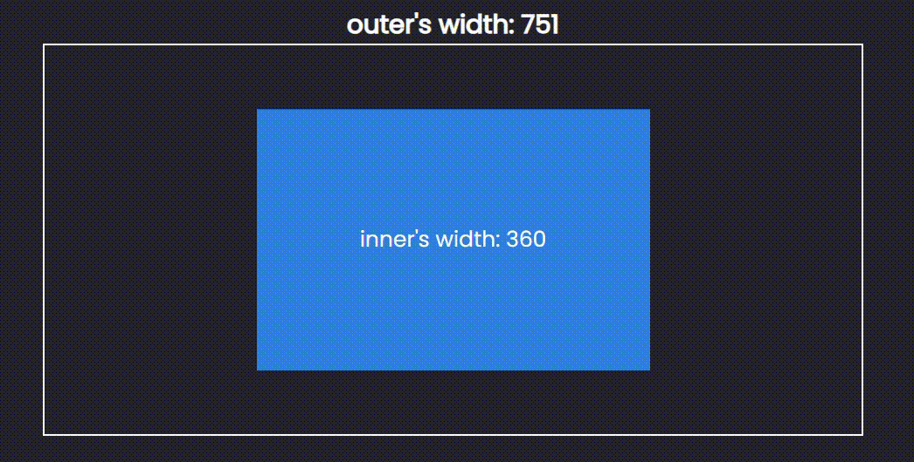

# 做 RWD 超好用的 CSS 函數 - max、min、clamp

現在所有網站的都一定是響應式了，所以如何讓排版適應各個螢幕大小，就是在考驗開發者的功力了，今天就來介紹三個對於排版上非常好用的 CSS 函數。

分別是:
1. max
2. min
3. clamp

在不久之前些函數的支援度還沒有很好，不過隨著瀏覽器的發展，幾乎在所以瀏覽器上都可以使用了！那就來看看這些函數是幹嘛的吧!


## max()

`max()` 會返回括號裡比較大的值，所以我們可以這樣使用來限制元素的寬度最小值:

```css
.inner {
  width: max(50%, 240px);
}
```


他的意思是會比較 240px 和 100% 50% 就是父元素的寬度的一半。
當父元素的寬度過小時， `max()` 就會返回 240px，這樣就限制 `.inner` 的最小寬度了。

他等同於這個傳統的寫法:
```css
.inner {
  width: 50%;
  min-width: 240px;
}
```

更酷的地方是，`max()` 和 `calc()` 一樣，是可以做運算的，你可以這麼寫:

```css
.inner {
  --padding: 16px;
  width: max(240px - var(--padding), 100%);
}
```


你可以設置全局的 padding 並用 max() 函數來限制寬度，非常有趣。

最後說一下，max 是可以傳入很多個參數的，不過傳入多個參數的機會比較少。

## min()

和 `max()` 相反， `min()` 會回傳比較小的值，所以他可以用來限制寬度的最大值，像這樣:

```css
.inner {
  width: min(360px, 50%);
}
```



這等同於:

```css
.inner {
  width: 50%;
  max-width: 360px;
}
```

而 min 和 max 一樣是可以在裡面做運算的:
```css
.inner {
  --padding: 16px;
  width: min(360px + var(--padding) * 2, 50%);
}
```

## clamp

這時你可能會想問，那如果我要同時限制最大最小值怎麼辦?

不要懷疑，請你值接用 `clamp`，他可以同時限制最大最小值，使用方法為:

```js
clamp(minValue, normalVal, maxValue);
```

舉例來說，我希望元素的寬度最大值是 360px 最小值是 240px，而一般是父元素的 50% 寬度，你就可以:

```css
.inner {
  width: clamp(240px, 50%, 360px)
}
```



傳統的寫法可以這樣寫:

```css
.inner {
  width: 50%;
  min-width: 240px;
  max-width: 360px;
}
```

這樣就限制住元素寬度的最大最小值了，非常好用！當然，他也和 `min`、`max` 一樣，是可以在裡面做運算的。

## 小結

今天介紹三個超好用的 CSS 函數，`max`、`min`、`clamp`，我自己覺得相較於 max、min，傳統寫法在語意上考能更好理解，不過在某些情況下，用 `max`、`min` 會更便捷，而 `clamp` 好用到不行，語意上也不難懂，推薦！