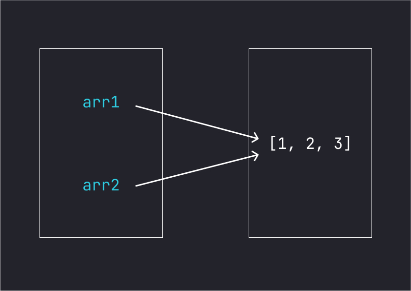

# JS 深淺拷貝

## 前言
深淺拷貝是面試很常問的問題，今天就來好好聊一聊在 JS 中的深淺拷貝，以及為甚麼要用深淺拷貝吧！

## 為甚麼要用淺拷貝？
對於一般的原始型別(Primitive Type)，像是 boolean、number、string ... 等，如果要複製值給另一個變數，直接賦值就可以了，像是:

```js
let user1 = 'Jack';
let user2 = user1;
console.log(user1); // Jack

user2 = 'Rose'
console.log(user1, user2) // Jack Rose
```

這樣是沒有問題的，但若改成物件型別 (Object Type)，像是陣列、物件，就無法這樣複製了:

```js
let arr1 = [1, 2, 3];
let arr2 = arr1;
console.log(arr2); // [1, 2, 3]

arr2.push(4);
console.log(arr1); // [1, 2, 3, 4]
console.log(arr2); // [1, 2, 3, 4]
```

會發現當我們修改 `arr2` 時，`arr1` 也會跟著改變，這是因為在 JS 中，將物件型別賦值給另一個變數時，變數的指向會指到同一個陣列的記憶體位置，如圖：



物件也會有相同的問題，所以要怎麼避免修改 `arr2` 時，`arr1` 也會有被修改的情況呢？

就要使用比較特別的方法來做淺拷貝。

## 淺拷貝如何實現
在 JS 中，有多種方法可以使用淺拷貝，但我覺得最簡單好用的方法是用展開運算子 `...` 來實現:

```js
// Array
let arr1 = [1, 2, 3];
let arr2 = [...arr1];

arr2.push(4);
console.log(arr1); // [1, 2, 3, 4]
console.log(arr2); // [1, 2, 3, 4]

// Ojbect
let obj1 = {a: 'a'};
let obj2 = {...obj1};

obj2.b = 'b';
console.log(obj1); // {a: 'a'}
console.log(obj2); // {a: 'a', b: 'b'}
```

這樣就很簡單解決陣列和物件指向的問題，但當陣列或物件裡面又有物件型別的資料時，就會產生問題:

```js
let user1 = {
  name: 'Jack',
  hobbies: ['coding', 'basketball']
};
let user2 = {...user1};

user2.name = 'Rose';
user2.hobbies.push('piano');
console.log(user1); // {name: Jack, hobbies: [coding, basketball, piano]}
console.log(user2); // {name: Rose, hobbies: [coding, basketball, piano]}
```
可以發現裡面的興趣 hobbies，都被修改到了，要怎麼解決這個問題？就要使用深拷貝。

## 深拷貝如何實現？
常見有兩種方法可以實現:
1. 將物件轉換成 JSON 格式，在轉換回來
2. 利用遞迴，遍歷所有屬性來檢查是否為物件型別

### 轉換成 JSON 格式
第一種方法很簡單，使用 `JSON.stringify()` 和 `JSON.parse()` 即可:

```js
let user1 = {
  name: 'Jack',
  hobbies: ['coding', 'basketball']
};
let user2 = JSON.parse(JSON.stringify(user1));

user2.name = 'Rose',
user2.hobbies.push('piano')

console.log(user1); // {name: Jack, hobbies: [coding, basketball]}
console.log(user2); // {name: Rose, hobbies: [coding, basketball, piano]}
```

可以這樣使用是因為，`JSON.stringify()` 會將所有的屬性都會被深拷貝到新的物件中，並轉換成 JSON 格式。
而 `JSON.parse()` 會創造新物件並將 JSON 轉換成 JS 物件。

但要注意，若物件裡面有函數，或是屬性引用自身物件時(循環引用)，這個方法就會失效，瀏覽器會直接報錯。如下:

```js
let user1 = {
  name: 'Jack',
  hobbies: ['coding', 'basketball'],
  sayHi() {
    console.log(`Hello, ${this.name}!!!`);
  },
};
user1.mySelf = user1;

let user2 = JSON.parse(JSON.stringify(user1));
// Uncaught TypeError: Converting circular tructure to JSON
```

畢竟 JSON 格式裡面不會有函數和引用自己本身。

所以要解決這個問題就只能使用第二種方法，自己手寫遞迴來遍歷所有的屬性。

### 手寫遞迴來遍歷物件屬性
我們先不要考慮循環引用的問題，先來看看如何實現基本的深拷貝。

```js
function cloneDeep(obj) {
  // 檢查傳入的參數是否為物件，如果不是則直接返回
  if (typeof obj !== 'object' || obj === null) {
    return obj;
  }

  // 創建一個空的物件或陣列
  const cloned = Array.isArray(obj) ? [] : {};

  // 遍歷原始物件的所有屬性，並將其深拷貝到目標物件中
  for (const key in obj) {
    // 判斷此屬性是否有值
    if (obj.hasOwnProperty(key)) {
      cloned[key] = cloneDeep(obj[key]);
    }
  }

  return cloned;
}
```
一開始先判斷傳入的參數是否回物件，接著判斷參數是物件還是陣列，因為在 JS 裡，對物件或陣列用 `typeof` 都會回傳 `object`。

接著用 `for...in` 來循環遍歷每個屬性，並遞迴一次，若屬性是原始型別就會直接回傳，若是物件型別則又會自遞迴一次。


```js
let user1 = {
  name: 'Jack',
  hobbies: ['coding', 'basketball'],
  sayHi() {
    console.log(`Hi, ${this.name}`)
  }
};
let user2 = cloneDeep(user1);

user2.name = 'Rose';
user2.hobbies.push('piano');
user2.sayHi = function sayHi() {
  console.log(`Hello, ${this.name}`)
}

user1.sayHi() // Hi, Jack
user2.sayHi() // Hello, Rose
 
console.log(user1); // {name: Jack, hobbies: [coding, basketball], sayHi...}
console.log(user2); // {name: Rose, hobbies: [coding, basketball, piano], sayHi...}
```

可以發現成功深拷貝了！

## 深拷貝 - 循環引用
前面的方法若遇到循環引用，會無限遞迴然後出錯，要解決這個循環引用的問題，我們需要每次都將引用類型的鍵和值都記錄下來，以免不斷重複的遞迴。

由於 Object 的鍵不能是物件，所以我們不能用 Object 記錄，這裡採用了 WeakMap 來記錄：

```js
function cloneDeep(obj, map = new WeakMap()) {
  // 檢查傳入的參數是否為物件，如果不是則直接返回
  if (typeof obj !== 'object' || obj === null) {
    return obj;
  }

  // 如果已經複製過了，直接返回之前複製的物件
  if (map.has(obj)) {
    return map.get(obj);
  }

  // 創建一個空的目標物件或陣列
  const cloned = Array.isArray(obj) ? [] : {};

  // 將複製的物件放入 Map 中
  map.set(obj, cloned);

  // 遍歷原始物件的所有屬性，並將其深拷貝到目標物件中
  for (const key in obj) {
    if (obj.hasOwnProperty(key)) {
      cloned[key] = cloneDeep(obj[key], map);
    }
  }

  return cloned;
}


let user1 = {
  name: 'Jack',
  hobbies: ['coding', 'basketball'],
  sayHi() {
    console.log(`Hi, ${this.name}`)
  }
};
user1.mySelf = user1;
let user2 = cloneDeep(user1);

user2.name = 'Rose';
user2.sayHi = function sayHi() {
  console.log(`Hello, ${this.name}`)
}

user1.mySelf.sayHi(); // Hi, Jack
user2.mySelf.sayHi(); // Hello, Rose
```

這樣就完成很完整的深拷貝了！

## 其它淺拷貝的方法
除了展開運算子，還可以使用其他方法來做淺拷貝，這裡大略提一下:
```js
// 使用 slice()、concat() 方法實現陣列淺拷貝
const arr1 = [1, 2, 3];
const arr2 = arr1.slice();
const arr3 = arr1.concat();

// 使用 Object.assign() 方法實現物件淺拷貝
const obj1 = { name: 'Alice', age: 20 };
const obj2 = Object.assign({}, obj1);
```

## 小節
今天很完整的講了深淺拷貝的用法，以及它們的差別，基本上 JSON 轉換就可以用在很多場景了，除非有特別情況，才會需要手寫來做深拷貝喔。

今天就這樣，下次見！