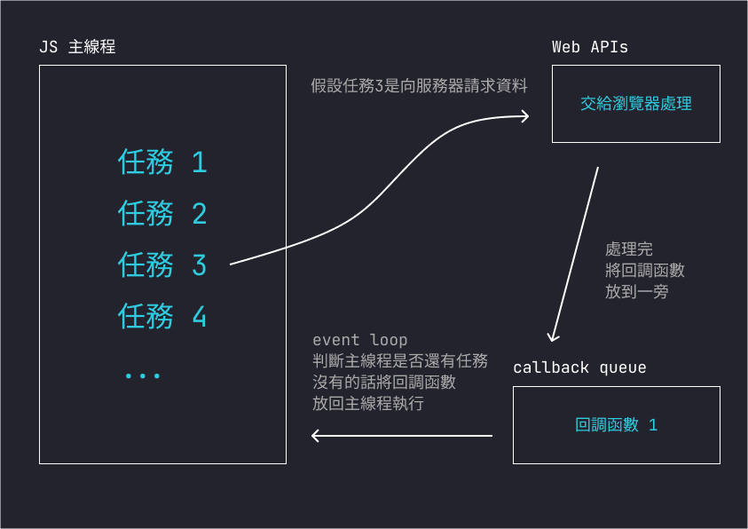

# JS event loop
## 前言
當我們在瀏覽器中執行 JS 時，通常會遇到一些**需要時間**來完成的任務，例如向服務器請求數據。這些任務可能需要花費很長時間來完成，但是我們又不能讓 JS 的執行停頓下來，導致頁面無法響應用戶的操作。

因此，JS 引入了一種稱為「事件循環 event loop」的機制，來協調這些任務和 JavaScript 主線程的執行。

但在了解 event loop 之前，我們要先知道一些 JS 的觀念。

## JS 是單線程 single threaded
JS 是單線程(single threade runtime)的程式語言，也就是他一次只能一件事情，無法同時處理多個事情。

## 阻塞 blocking
由於 JS 是單線程的關係，若有一段程式碼需要很長的處理時間，例如

```javascript
let total = 0;
console.log(1);
for (let i = 0; i < 1000000000; i++) {
  total += i;
}
console.log(2);
```
會發現 `console.log(2)`，需要等待一段時間才會執行，這被稱為`阻塞 blocking`。

阻塞時，瀏覽器沒辦法處理其他事情，這會造成網頁的 lag。


## 執行堆疊 call stack
在 JS 中的有一個容器負責記錄主線程中要執行的程式碼，也就是執行堆疊(call stack)，假設現在有段程式碼:

```js
console.log(1);
console.log(2);
```

JS 會執行以下步驟:
1. 將 console.log(1) 放入堆疊 call stack
2. 執行 console.log(1)
3. 將 console.log(2) 放入堆疊 call stack
4. 執行 console.log(2)

如果執行到某個函式時，便會把這個函數內部要執行的程式碼，添加到堆疊中，若程式遇到 `return`，則會將整個函數從堆疊的最上方抽離 (pop)。

換句話說，就是遇到 return，函數內部後面的程式碼就不執行了。

不過若函數是無窮迴圈:

```js
function loop() {
  return loop()
}
loop()
```

那 call stack 將會被不斷疊加上去，直到瀏覽器出現錯誤


## 非同步處理 Async Callback
為了解決阻塞的問題，我們可以透過非同步的方式來處理，例如設置 `setTimeout` 將會阻塞的程式碼移到後面執行

```js
console.log('1');

setTimeout(() => {
  let total = 0;
  console.log(3)
  for (let i = 0; i < 1000000000; i++) {
    total += i;
  }
  console.log(4);
}, 1000)

console.log('2');

// 1
// 2 (馬上執行)
// 3 (一秒後執行)
// 4 (一秒後過一段時間執行)
```
在執行這段程式碼時，
1. 執行 1
2. 接著將 `setTimeout`，給瀏覽器處理計時問題。
3. 執行 2
4. 一秒後將 `setTimeout` 回調函數放到 `工作佇列(task queue)` 內
5. 等到所有堆疊中的內容皆被執行完後，執行回調函數。
6. 執行 3
7. 運算 `total`
8. 執行 4

這裡的 `setTimeout` 可以想像成向服務器請求數據。


## 瀏覽器是多線程
所以 JS 能看起來一次處理很多事情，是因為瀏覽器是多線程，像是 DOM、ajax、setTimeout...等都是瀏覽器提供的 api，他們都是在瀏覽器上運行的，運行完後會將回調函數放回工作佇列 callback queue，等待 call stack 裡面的內容執行完後，才執行回調函數。


那是誰來判斷 call stack 裡面的任務是否執行完了呢？沒錯，就是**事件循環 event loop**，他會**判斷 call stack 是否為空**。

若為空，就將 task queue 中的第一個項目放到 call stack ，讓他被執行。


## JS 和 event loop
把上面的觀念綜合在一起，就可以發現 JS 就像是一個工廠的流水線，它會將所有需要處理的任務照順序執行。

但是有些**特別**的任務，例如向服務器請求數據，JS 主線程就會將這個任務交給瀏覽器處理，同時繼續執行流水線中的其他任務。也就是**確保主流水線是通順的**，將麻煩的任務丟給其它人做處理。

**當該任務完成時，裡面的回調函數會先被放到旁邊 (工作佇列 callback queue)**，等待 JS 執行完主線程的任務後，才會被放回主線程中執行回調函數，**而判斷 JS 是否執行完主線程的東西就是 event loop。**




## 觀察 event loop 的實用工具網站

可以利用<a href="http://latentflip.com/loupe/?code=JC5vbignYnV0dG9uJywgJ2NsaWNrJywgZnVuY3Rpb24gb25DbGljaygpIHsKICAgIHNldFRpbWVvdXQoZnVuY3Rpb24gdGltZXIoKSB7CiAgICAgICAgY29uc29sZS5sb2coJ1lvdSBjbGlja2VkIHRoZSBidXR0b24hJyk7ICAgIAogICAgfSwgMjAwMCk7Cn0pOwoKY29uc29sZS5sb2coIkhpISIpOwoKc2V0VGltZW91dChmdW5jdGlvbiB0aW1lb3V0KCkgewogICAgY29uc29sZS5sb2coIkNsaWNrIHRoZSBidXR0b24hIik7Cn0sIDUwMDApOwoKY29uc29sZS5sb2coIldlbGNvbWUgdG8gbG91cGUuIik7!!!PGJ1dHRvbj5DbGljayBtZSE8L2J1dHRvbj4%3D" target="_blank" rel="noopener">這個網站 loupe</a> 實際看到 js event loop 究竟在搞什麼鬼。

以它提供的例子來說:

```js
$.on('button', 'click', function onClick() {
    setTimeout(function timer() {
        console.log('You clicked the button!');    
    }, 2000);
});

console.log("Hi!");

setTimeout(function timeout() {
    console.log("Click the button!");
}, 5000);

console.log("Welcome to loupe.");
```
1. `$.on(...)` 放入 call stack
2. `$.on(...)` 放入 webAPIs 等待被觸發
3. `console.log("Hi!")` 放入 call stack
4. `setTimeout()` 放入 webAPIs，並等待五秒的時間
5. 同時將 `console.log("Welcom to loupe")` 放到 call stack
6. 五秒後將 `setTimeout()` 中的 callback 放到 callback queue
7. event loop 將 callback queue 中的 function 放到 call stack 執行

而點擊按鈕後
1. 將 click 事件放到 callback queue，並等待所有 call stack 事件執行完後才會被放到 call stack 執行，
2. 再將 `setTimeout` 放入 webAPIs 計時，計時完後放到  callback queue
3. 再由 event loop 放到 call stack 執行回調函數

ajax 請求也是同理，所以 js 中看似同時執行很多事情是因為 webAPIs、callback queue、event loop 的幫忙，js 本身還是單線程的。

## 總結
所以 JS 在做 ajax 請求時能不阻塞程式碼，是因為請求的過程由瀏覽器完成了，JS 只負責處理回調函數裡面的程式碼片段，setTimeout 也是一樣，計時的工作交給瀏覽器，而 JS 也只負責回調函數的部分。