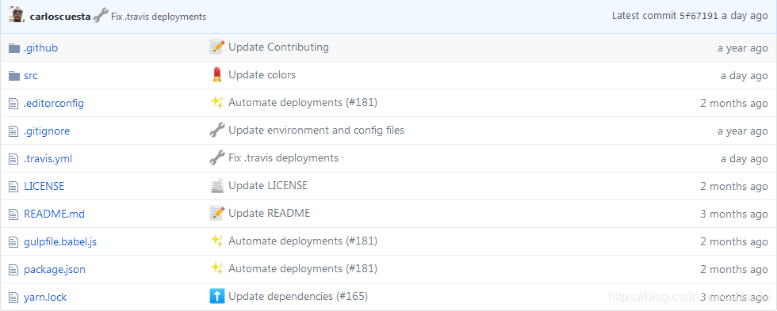

# 前言
相信你或多或少都會使用 git 指令來上傳自己的程式碼到 github     

我之前寫 git commit message 時都很頭痛，不知道要怎麼寫清楚做了那些修改，於是整理了一篇 git commit message 規範給你參考，希望讓你
之後也能寫出清楚的 git commit message。

## 為甚麼要寫好提交紀錄
不知道你有沒有這樣過，在需要對程式碼進行大量的修改和調整時，發現提交紀錄簡單到沒有任何意義但當你回顧提交紀錄時，或沒有描述相關的細節信息。

這樣不僅讓你難以管理和回溯程式碼，也會給你的團隊成員帶來困擾，讓他們無法快速了解程式碼的變更和目的，增加開發、溝通成本。

因此寫好 Git 提交紀錄對於想順利進行專案來說，是非常重要的。

而好的 git commit message 也能帶來這些優點：

1. 清晰的歷史記錄：當你回顧 Git commit log 時，每一個 commit message 會有你對那次修改的簡要說明。如果你能夠寫出有意義且詳盡的 commit message，那麼你的 Git log 會更清晰，讓你和你的團隊能更快找到所需的信息。
2. 更好的團隊協作：如果你正在與他人合作開發項目，良好的 commit message 能夠幫助其他開發者更容易理解你的程式碼修改，有助於減少溝通成本，使得團隊工作更有效率。
3. 方便的程式碼回溯：當你需要回溯到之前的某一個 commit 時，如果該 commit 的 message 是有意義的，那就可以更快找到所需的修改，從而更加準確地回溯到過去的程式碼版本。

所以如何寫好一個 git message 也很重要，利於後續的維護和合作

## 好的 git commit message 長什麼樣子
目前使用較多的規範式 "Angular 團隊的提交紀錄規範"，它的 message 格式如下：

```
<type>(<scope>): <subject>

<body>

<footer>
```

1. **`<type>`**: 指定 commit 的類型，例如 fix, feat, docs, style, refactor, test 等等。這有助於更好地分類和管理你的 commits。
2. **`<scope>`**: 可選參數，表示影響範圍，例如文件名、模組名、功能等等。
3. **`<subject>`**: 簡短的說明 commit 的目的，通常不超過 50 個字符。
4. **`<body>`**: 可選參數，詳細描述 commit 的修改內容。如果標題簡短不足以說明 commit 的內容，可以使用正文進行補充。補充時可以用條列式會更清楚。一個好的 subject 會包含 1. 為什麼做 2. 我怎麼做
6. **`<footer>`**: 可選參數，通常用於關閉 issues 或者引用其他 commit。

除了 `<type>` 和 `<subject>` 以外，其他都是有需要再補充就好。

## 常用的 type 類型
下面舉出 10 種常見的 `<type>` 和實際應用時的例子

1. **`feat`**: 新增功能（feature）
    - 新增用戶註冊的功能
    
    ```
    feat(authentication): add user registration feature
    
    Implement the user registration feature, including backend API and front-end form.
    ```
    
2. **`fix`**: 修復錯誤（bug fix）
    - 修改在登入時會出現 500 error 的錯誤
    
    ```
    fix(authentication): fix 500 error during login
    
    Fix a server-side bug that caused a 500 error when users tried to log in. The bug was caused by an incorrect database query.
    ```
    
3. **`docs`**: 文檔（documentation）
    - 更新 readme 文檔中使用 API 的例子
    
    ```
    docs(readme): update API usage example
    
    Update the README file with a new example of how to use the API to retrieve user data.
    ```
    
4. **`style`**: 格式、風格（formatting, style），不影響程式碼的運行結果
    - 格式化代碼並統一縮進風格
    
    ```
    style(ui): format code and unify indentation style
    
    Format the code using a linter and unify the indentation style to use tabs instead of spaces.
    ```
    
5. **`refactor`**: 重構代碼（refactoring），沒有新功能和修 bug
    - 重構用戶註冊代碼以使用共享函數
    
    ```
    refactor(authentication): refactor user registration code to use shared function
    
    Refactor the user registration code to use a shared function for validation and database insertion. This simplifies the code and reduces code duplication.
    ```
    
6. **`test`**: 增加或修改測試（adding or modifying tests）
    - 為用戶註冊 API 添加單元測試
    
    ```
    test(authentication): add unit tests for user registration API
    
    Add unit tests to ensure that the user registration API correctly validates user data and inserts the data into the database.
    ```
    
7. **`build`**: 構建系統、外部依賴變化（build system, external dependencies）
    - 升級 Node.js 到最新版本
    
    ```
    build(deps): upgrade Node.js to latest version
    
    Upgrade Node.js to the latest version to take advantage of new features and security fixes.
    ```
    
8. **`perf`**: 優化性能（performance optimization）
    - 優化登錄頁面載入速度
    
    ```
    perf(ui): optimize login page load speed
    
    Optimize the login page to reduce load times by compressing static assets and optimizing database queries.
    ```
    
9. **`chore`**: 維護性工作、代碼重構、增加測試等（maintenance work, code refactoring, adding tests, etc.）
    - 刪除未使用的變數和函數
    
    ```
    chore(code): remove unused variables and functions
    
    Remove unused variables and functions to reduce code complexity and improve maintainability.
    ```
    
10. **`revert`**: 撤銷提交（reverting a previous commit）
    - 撤回之前導致致命錯誤的提交
    
    ```
    revert(authentication): revert previous commit that caused critical bug
    
    Revert the previous commit that introduced a critical bug in the authentication system. This will temporarily disable the feature until a fix can be implemented.
    ```

## 增加 emoji

除了 git commit message 的格式以外，也可以增加 emoji 來讓畫面更豐富跟清楚(也更可愛)，比如說



是不是比文字更清楚生動～

不過 emoji 也不能亂用，可以參考這網站的使用方式

[gitmoji](https://gitmoji.dev/)

使用方法是在前面加上  :emoji-name 即可，例如

```jsx
:feature feat(login): add login feature
```

## 隨機生成 message

最後如果你自暴自棄覺得寫 git commit message 好麻煩

這邊推薦一個網站會隨機生成 git commit message

[https://whatthecommit.com/index.txt](https://whatthecommit.com/index.txt)

他會出現像是 `does it work? maybe. will I check? no.` `drink to much.` `Still can't get this right...`等無俚頭的句子

提交時只要這樣使用就可以隨機生成 message

`git commit -m"`curl -s http://whatthecommit.com/index.txt`"`

工作上請謹慎使用…

## 如何規範 git commit message

使用 Commitize 非常簡單，只需要按照以下步驟操作：

首先，你需要在項目中安裝 Commitize。可以使用 npm 命令進行安裝，具體的命令如下：

Copy code
npm install -g commitizen cz-conventional-changelog
安裝完成之後，在項目的根目錄下建立一個 .czrc 文件，並將其配置為使用 cz-conventional-changelog，具體的內容如下：

json
Copy code
{
  "path": "cz-conventional-changelog"
}
接下來，使用 git cz 命令來替代 git commit 來創建一個新的提交紀錄。Commitize 會自動彈出一個交互式介面，讓你選擇代碼變更的類型、範圍、描述等相關信息。

最後，提交你的代碼變更即可。Commitize 會自動生成符合規範的提交紀錄，讓你的提交紀錄更加規範和統一。

總之，使用 Commitize 非常方便，只需要幾個簡單的步驟即可讓你的 Git 提交紀錄更加規範和統一。

cz-conventional-changelog 是一個 Commitizen 的插件，用於生成符合慣例式提交訊息的工具，這些慣例通常是由 AngularJS 社區所推廣的。

通過使用 cz-conventional-changelog，可以讓開發人員在提交變更時使用預先定義好的類型、範圍和描述等相關信息，從而讓提交紀錄更加統一和易於理解。

透過使用 cz-conventional-changelog，可以讓開發人員更加規範地提交變更，從而讓代碼庫的提交紀錄更加清晰和易於維護。

[优雅的提交你的 Git Commit Message - 掘金 (juejin.cn)](https://juejin.cn/post/6844903606815064077#heading-2)

[Git commit message 规范 - 掘金 (juejin.cn)](https://juejin.cn/post/6844903871832145927)

[Git Commit Message 应该怎么写？ - 掘金 (juejin.cn)](https://juejin.cn/post/6960541430473293837)