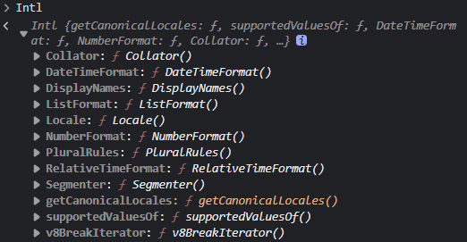

# 如何規範每個地區的時間和貨幣單位？JS Intl API

Intl API 是 JS 內建的一個國際化 API，他提供許多物件、方法來處理不同地區和語言的文法、日期、貨幣格式，讓你在遇到網站需要國際化時，遇到的格式問題。

我們可以直接在控制台裡輸入 Intl，可以發現有許多物件:

```js
Intl
```


我們來一個一個看這些物件可以幹嘛吧。

## 1. Intl.Collator

`Intl.Collator` 用來比較和排序字串，他接受兩個參數，像下面這樣:

```js
const intl = Intl.Collator(locales, { options })
```

1. locales: 這個參數可以指定用哪個語言的語法來排序，是根據 BCP 47 來決定的，比如台灣是 zh-TW
2. options: 可選參數，用來調整一些在比較時的設定


`Collator` 可以根據當地語言的特性來排序，比如我們在使用 `sort()` 做排序的時候，可能會因為中文的關係出現意料之外的排法，此時我們就可以用 `Intl.Collator` 解決，像是我們可以用注音來排序:

```js
const names = ['李四', '王二', '張三', '陳一']
const collator = new Intl.Collator('zh-TW', {
    collation: 'zhuyin',
});

names.sort(collator.compare);
// ['李四', '張三', '陳一', '王二']
```
其中 collation 有多種值可以選擇，跟中文有關的有
1. zhuyin: 依照注音排序
2. stroke: 依照筆畫排序
3. pinyin: 依照漢語拼音做排序

而 `collator.compare` 是對傳入的兩個參數做比較，所以可以搭配陣列的 `sort()` 做使用:

```js
console.log(new Intl.Collator().compare("a", "c")); // -1
console.log(new Intl.Collator().compare("c", "a")); // 1
```

除了依照注音排序，也可以像這樣對中文的數字做排序:

```js
const numbers = ['五', '三', '四', '一', '二']
const collator = new Intl.Collator('zh-TW', {
  numeric: true,
});

numbers.sort(collator.compare);
['一', '二', '三', '五', '四']
```


## 2. Intl.DataTimeFormat

他用來根據不同的語言，轉換不同的日期或時間格式，Intl 系列基本上都包含兩個參數，差別在於第二個參數可以傳入的屬性，會根據使用 Intl 方法而有所不同

使用方法如下:

```jsx
const date = new Date();
const options = {
  dateStyle: 'full',
  timeStyle: 'medium',
  hour12: true,
  timeZone: 'Asia/Taipei',
};
const formatter = new Intl.DateTimeFormat('zh-TW', options);
const formattedDate = formatter.format(date);
console.log(formattedDate); // 2023年4月28日 星期五 晚上9:56:08
```

- dateStyle: 決定日期的表示方式
  - full: 2023年4月28日 星期五
  - long: 2023年4月28日
  - medium: 2023年4月28日，在中文裡和 long 一樣
  - short
- timeStyle: 決定時間 (時 /  分 / 秒) 的表示方式
  - full
  - long
  - medium
  - short
- hour12: 時間是 12 小時還是 24 小時制
  - true: 12小時
  - false: 24 小時
- timeZone: 時區

也可以客製化年月日

```jsx
const date = new Date();
const options = {
  year: '2-digit',
  month: '2-digit',
  day: '2-digit',
  hour: '2-digit',
  minute: '2-digit',
  second: '2-digit',
  hour12: false,
  timeZone: 'Asia/Taipei',
};
const formatter = new Intl.DateTimeFormat('zh-TW', options);
const formattedDate = formatter.format(date);
console.log(formattedDate); // 23/04/28 22:02:49
```

其中 `2-digit` 表示一定使用 2 位數字表示，若數字沒超過 10，會在前面補 0

還有非常多的屬性可以調整，有需要再去看就好

## 3. Intl.ListFormat

用來將多個元素的陣列格式轉換成我們常用的文法，例如

```jsx
const fruits = ['蘋果', '香蕉', '橘子', '芒果'];
const options = { style: 'long', type: 'conjunction' };
const formatter = new Intl.ListFormat('zh-TW', options);
const formattedList = formatter.format(fruits);
console.log(formattedList); // "蘋果、香蕉、橘子和芒果"
```

## 4. Intl.NumberFormat

Intl.NumberFormat 用來格式轉換數字，轉換成特定語言的用法，例如增加逗號，也可以增加貨幣符號

```jsx
const formatter = new Intl.NumberFormat('zh-TW', {
  style: 'currency',
  currency: 'TWD',
  currencyDisplay: 'name'
});

const price = 1234.56;
console.log(formatter.format(price)); // 1,234.56 新台幣
```

- style: 數字格式轉換使用的樣式
    - decimal: 純數字
    - currency: 可以指定 currency 屬性來增加貨幣單位
    - percent: 百分比
- currency: 指定貨幣的單位，參考 ISO 4217 的貨幣代碼 (可以上維基看每個國家的貨幣代碼，例如台灣是 TWD，美金是 USD)
- currencyDisplay: 貨幣單位的表示方式
    - symbol: 用符號表式
    - code: 用 ISO 4217 貨幣代碼表示
    - name: 用語言表示

這個方法蠻特別的，他還可以做些數字上的操作，例如千分數字或前面補 0，甚至是數字轉中文

```jsx
new Intl.NumberFormat().format(12345.6789);
// 结果是："12,345.679"

new Intl.NumberFormat('en-US', {
    minimumIntegerDigits: 2
}).format(8); // 结果是："08"

new Intl.NumberFormat('en-US', {
  style: 'percent',
  minimumFractionDigits: 2,
}).format(0.75); // 75.00%

new Intl.NumberFormat('zh-Hans-TW-u-nu-hanidec').format(123456)
// '一二三,四五六'
```

## 5. Intl.RelativeTimeFormat

Intl.RelativeTimeFormat 是用來表示相對時間的，比如5分鐘前或3個月後**

```jsx
const formatter = new Intl.RelativeTimeFormat('zh-TW', {numeric: 'auto'});
console.log(formatter.format(-3, 'day')); // 3 天前
console.log(formatter.format(-1, 'day')); // 昨天
console.log(formatter.format(2, 'day')); // 明天過後 不對，是 後天
console.log(formatter.format(1, 'hour')); // 1 小時候
```

- numeric: 表示相對時間的方式
    - always: 永遠用數字表示，比如昨天會變 1 天前
    - auto: 自動使用語言常用的方式

不過可惜的是，他並不支持直接傳日期進去計算時間差，只能額外計算

```jsx
const createRelativeTimeString = (dateString) => {
  const now = new Date();
  const postDate = new Date(dateString);
  const timeDiff = now.getTime() - postDate.getTime();
  const daysDiff = Math.floor(timeDiff / (1000 * 3600 * 24));
  const hoursDiff = Math.floor(timeDiff / (1000 * 3600));

  if (daysDiff > 7) {
    // 超過一個禮拜，用日期表示
    const formatter = new Intl.DateTimeFormat('zh-TW');
		return formatter.format(postDate);
  } else if (daysDiff > 0) {
    // 一個禮拜以內，用幾天前表示
    const rtf = new Intl.RelativeTimeFormat('zh-TW');
    return rtf.format(-daysDiff, 'day');
  } else {
    // 一天內，用小時表示
    const rtf = new Intl.RelativeTimeFormat('zh-TW');
    return rtf.format(-hoursDiff, 'hour');
  }
};

// 假設今天是 2023/4/28
console.log(createRelativeTimeString('2023-04-25T12:00:00Z')); // 3 天前
console.log(createRelativeTimeString('2023-04-28T09:00:00Z')); // 5 小時前
console.log(createRelativeTimeString('2023-04-20T12:00:00Z')); // 2023/4/20
```