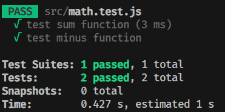
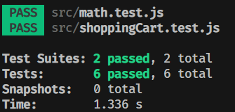

# 單元測試(Unit Test)是甚麼？


## 前言

不知道你有沒有在改完程式碼後，出現意料之外的錯誤過，然後又要花時間找錯誤，其實只要把單元測試寫好，就能避免這樣的問題，今天就來看看前端單元測試到底在寫什麼吧！

## 甚麼是單元測試

單元測試（Unit Testing）是一種測試的方法，主要是在確認你的函數、方法、組件的功能正確運行，當出錯時也可以及時發現，雖然寫測試會花額外的時間，但帶來的好處是可以提高程式碼可靠性，並改善後續維護的複雜度。

要寫測試需要用到一些函式庫，現在最流行的是 FB 開發的 Jest，接著就跟我一起寫你的第一個測試吧！

## 來寫第一個測試

在寫測試之前，我們先安裝專門用來測試的函式庫 Jest，打開終端機輸入指令來安裝

```bash
npm init -y
npm install jest -D
```
然後新增一個 math.js 檔案，寫上簡單的加法和減法函數，然後 export 函數。

```js
// math.js
function sum(a, b) {
  return a + b;
}

function minus(a, b) {
  return a - b;
}

module.exports = { sum, minus };
```

接著我們新增負責寫測試的檔案，命名要注意喔，要命名成 `math.test.js`

```js
// math.test.js
const { sum, minus } = require('./math');

test('test sum function', () => {
  expect(sum(1, 2)).toBe(3);
});

test('test minus function', () => {
  expect(minus(2, 1)).toBe(1);
});
```
`test()`、`expect()`、`toBe()` 都是 Jest 提供的函數。其實很好理解。

```js
test('測試的描述', () => {
  expect(你的函數).toBe(期望的結果);
})
```

寫好後就可以來測試了，先更改 package.json 裡的 test 腳本
```json
// package.json
{
  "scripts": {
    "test": "jest"  👈
  },
  // ...
}
```

接著在終端機輸入指令執行測試

```bash
npm test
```
就可以看到終端機跳出通過測試的通知了



這樣當我們修改 math.js 的程式碼後，就能夠及時發現錯誤，增加程式碼的穩健。

## given, when, then

我們在稍微深入一點，其實每個測試都可以分成 given(前提), when(行為), then(結果) 的結構，以上面 `math.test.js` 的例子來說，我們可以改寫一下就可以看出這樣的結構

```js
// math.test.js
const { sum, minus } = require('./math');

test('test sum function', () => {
  // given
  const number1 = 1,
    number2 = 2;

  // when
  const result = sum(number1, number2);

  // then
  expect(result).toBe(3);
});

//...
```

以後寫測試的時候就可以遵循這樣的結構來寫，可以讓新手更有方向寫測試。

不過因為這個函數相對簡單，感受不太到測試的好處，接下來我們更進一步來寫個購物車的測試吧！

## 寫一個購物車的測試
我們先新增 shoppingCart.js 檔案，寫一個新增、移除、清空、計算總金額的函數
```js
class ShoppingCart {
  constructor() {
    this.items = [];
  }
  // 新增商品
  addItem(item) {
    this.items.push(item);
  }
  // 移除商品
  removeItem(itemIndex) {
    this.items.splice(itemIndex, 1);
  }
  // 計算總金額
  getTotalPrice() {
    return this.items.reduce(
      (total, item) => total + item.price, 0);
  }
  // 清空購物車
  clearCart() {
    this.items = [];
  }
}

module.exports = ShoppingCart;
```

接著一樣來寫購物車方法的測試，新增 `shppingCart.test.js`，我們先寫增加、移除商品的測試

```js
const ShoppingCart = require('./shoppingCart');

describe('ShoppingCart', () => {
  let cart;
  beforeEach(() => {
    // given
    cart = new ShoppingCart();
  });

  test('add items to the cart', () => {
    // when
    cart.addItem({ name: 'Product 1', price: 10 });
    cart.addItem({ name: 'Product 2', price: 20 });
    // then
    expect(cart.items).toHaveLength(2);
  });

  test('remove item from the cart', () => {
    // when
    cart.addItem({ name: 'Product 1', price: 10 });
    cart.addItem({ name: 'Product 2', price: 20 });
    cart.addItem({ name: 'Product 3', price: 30 });
    cart.removeItem(1); // 移除第二個商品
    // then
    expect(cart.items).toHaveLength(2);
    expect(cart.items[1].name).toBe('Product 3');
  });
});
```

這裡的 `beforeEach()`、`toHaveLength()` 也是 Jest 提供的函數。

`beforeEach()` 是在每次 `test()` 前會執行的函數，`toHaveLength()` 可以判斷陣列的長度。

接著我們繼續寫計算金額和清空購物車的測試

```js
// shoppingCart.test.js
describe('ShoppingCart', () => {

  // ...

  test('calculate the total price', () => {
    cart.addItem({ name: 'Product 1', price: 10 });
    cart.addItem({ name: 'Product 2', price: 20 });
    cart.addItem({ name: 'Product 3', price: 30 });
    const totalPrice = cart.getTotalPrice();

    expect(totalPrice).toBe(60);
  });

  test('clear all items of cart', () => {
    cart.addItem({ name: 'Product 1', price: 10 });
    cart.addItem({ name: 'Product 2', price: 20 });
    cart.clearCart();

    expect(cart.items).toHaveLength(0);
  })
});
```

接著一樣執行指令來測試

```bash
npm test
```



這樣當我們需要修改像購物車一樣複雜的功能時，就能確保我們及時發現哪裡有錯誤，不然程式碼一多，除錯是非常痛苦的事情，而且寫測試除了能讓我們很快發現是哪個函數出問題以外，也能讓其他人更容易理解我們程式碼在做些什麼，所以寫測試是很重要的事情。

## 小結
今天很簡單的介紹了單元測試和 Jest 的使用方式，最後總結寫測試的五大好處

1. 錯誤偵測： 單元測試可以幫助開發人員及早發現程式碼中的錯誤和缺陷。每個單元測試都是獨立的，並且針對一個特定的功能，這使得定位和修復錯誤變得更加容易。
2. 確保正確性： 透過測試，我們可以確保程式碼的功能達到預期，提高程式碼品質和穩定性。
3. 減少重構時錯誤： 在開發新功能或進行程式碼修改時，單元測試可以快速確認這些更改是否影響到原本的功能，減少找錯誤的時間。
4. 增進團隊協作： 寫單元測試也能讓團隊成員更容易理解程式碼的功能和預期行為。幫助其他成員快速了解程式碼。
5. 提高程式設計能力： 因為寫測試需要將程式碼拆分成可測試的獨立單元。這其實需要我們思考更良好的程式設計，將功能模組化、減少程式碼的耦合性和複雜性。

最後分享我在網路上看到的一句話：寫不好單元測試是能力的問題，不寫單元測試則是態度的問題。你覺得呢？