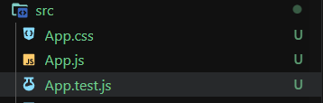
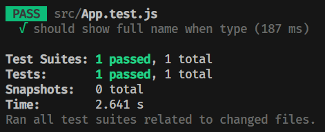

接下來要介紹如何對組件進行測試

其實在組件化（框架）出現之前，前端 UI 是很難進行測試的，因為整個程式碼太長了，所以組件化不僅是覆用，也可以讓邏輯分而治之，讓測試變得容易

而在組件化測試中，我們應該要專注在那些比較獨立的組件，因為如果反覆渲染最上層的組件，是會減慢測試的速度，測試也會變得非常複雜

接下來就讓我用 React 當示範，來寫我們第一個 UI 測試吧！

## Testing Library

Testing Library 是用來測試 UI 組件的函式庫，支援很多種框架，包括 Vue、React、Angular

我們先使用 create react-app 來建立 react 應用，

```bash
npm create react-app UI-test --template typescript
```

用 create react-app 就已經會自動安裝 testing library 了，打開資料夾可以發現他已經內建一個最基本的測試



裡面的內容為

```jsx
import { render, screen } from '@testing-library/react';
import App from './App';

test('renders learn react link', () => {
  // given
  render(<App />);
  // when
  const linkElement = screen.getByText(/learn react/i);
  // then
  expect(linkElement).toBeInTheDocument();
}); 
```

render 和 screen 是 testing library 提供的函數，render 用來渲染我們指定的組件，而 screen 是用來獲取畫面上指定的元素或文字，依照前幾篇提到的 given when then 結構，可以看成

1. 渲染組件
2. 取得 learn react 文字的元素，叫他 linkElement
3. 預期 linkElement 會出現在畫面中

而 `screen.getByText(/learn react/i) ****`是用正則來找包含 "learn react" 文字的元件。**`i`** 修飾符表示不區分大小寫。

`expect(linkElement).toBeInTheDocument()` 是預期 linkElement 會出現在 document 中

總結來說，這段程式碼是一個使用 React Testing Library 來確保在渲染 **`<App />`** 元件後，能夠在畫面中找到含有 "learn react" 文字的元素。如果找到，測試就會通過。

## 來寫第一個 UI 測試

接著讓我們稍微更改一下 App.js，在裡面給他一個 state

```jsx
import './App.css';
import { useState } from 'react';

function App() {

  const [name, setName] = useState('')

  return (
    <div className='App'>
      <input 
        type="text" 
        value={name} 
        onChange={(e) => setName(e.target.value)}
        placeholder='Type your name'
      />
      <p>My name is <span>{name}</span></p>
    </div>
  );
}

export default App;
```

整個邏輯很簡單，在 input 輸入名字後，畫面會跟著跟改變

[App.js display](./assets/images/3-UI-test/0.mp4)

ok，那我們來寫測試

```jsx
import { render, screen, act } from '@testing-library/react';
import userEvent from '@testing-library/user-event';
import App from './App';

test('should show full name when type', () => {
  // given
  const name = 'this.web';
  // when
  render(<App />);
  act(() => {
		userEvent.type(screen.getByPlaceholderText('Type your name'), name);
	})
  // then
  expect(screen.getByText(name)).toBeInTheDocument();
});
```

如果我們要模擬使用者的行為，可以使用 testing library 提供的 userEvent 來模擬，像這裡是模擬 type 行為，先利用 `getByPlaceholderText` 找到輸入框，第二個參數是要 type 的值。

要注意的是，只要是會讓 React state 更新的行為，就要使用 testing library 提供的 `act()` 函數包起來，`act()` 會模擬 React 的異步操作。

接者我們期望輸入的 name 要在畫面中出現，所以使用 `toBeInTheDocument` 。

(Placeholder text 是輸入框裡面灰色的提示)

接著執行測試，可以發現通過了！這樣我們就寫了屬於我們的第一個 UI 測試



## 小結

今天介紹了 testing library 以及 UI 測試的方法，例如如何模擬使用者行為，但礙於篇幅的關係，這次就先簡單介紹，讓你熟悉，下禮拜我們來寫複雜一點的 to do list 測試，如果你想更深入了解測試，不要錯過喔！那今天就這樣，下次見！